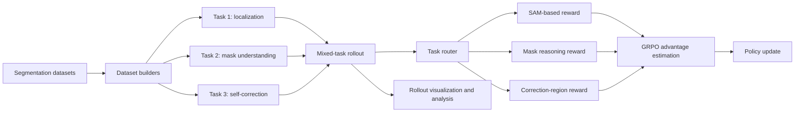

# AgenticSeg-RL

AgenticSeg-RL is a multi-task reinforcement learning system for reasoning-driven image segmentation. It extends a distributed GRPO training stack with task-aware reward routing, synthetic self-correction data, rollout visualization, and diagnostics for multimodal reasoning models.

The project focuses on a practical question: how can a vision-language model learn not only to localize an object, but also to inspect a mask, identify an error region, and correct its own segmentation behavior?

## Highlights

- **Three-task training curriculum** covering target localization, mask understanding, and segmentation self-correction.
- **Task-aware reward routing** that dispatches each sample to the correct scoring path without splitting the training loop.
- **Synthetic correction data** generated from controlled false-positive and false-negative mask perturbations.
- **Structured Task 3 rewards** combining output format, label correctness, polygon proximity, and region-hit signals.
- **Rollout diagnostics** with local visualizations, W&B logging support, and sample-level reward analysis.
- **Distributed GRPO training** with LoRA, FSDP, Ray, and vLLM integration.

## System Overview



## Task Design

### Task 1: Reasoning Localization

The model receives an image and a reasoning query, then predicts points that identify the target object. A segmentation model converts point predictions into masks, enabling spatially grounded rewards.

### Task 2: Mask Understanding

The model judges whether a candidate mask is already sufficient or requires refinement. The dataset builder derives supervision from effective IoU and boundary-aware mask quality signals.

### Task 3: Self-Correction

The pipeline creates realistic mask defects by either adding a false-positive polygon or removing a false-negative region. The model predicts the error type and a point inside the changed region. Reward components measure:

- response format validity;
- error-label correctness;
- distance to the changed polygon or region center;
- whether the predicted point hits the intended correction region.

## Repository Layout

```text
AgenticSeg-RL/
|-- configs/                    # Training configuration
|-- data/                       # Local datasets; README is tracked
|-- pretrained_models/          # Local model weights; README is tracked
|-- checkpoints/                # Generated training checkpoints
|-- scripts/
|   |-- train/                  # Reproducible multi-task launch scripts
|   |-- evaluate/               # Evaluation entry points
|   `-- inference/              # Standalone inference
|-- tools/
|   |-- datasets/               # Task 2/3 dataset construction
|   |-- data_analysis/          # Dataset inspection and rendering
|   |-- evaluation/             # Metrics and evaluation pipeline
|   |-- rollout_analysis/       # Reward-log aggregation and reports
|   `-- benchmark_preparation/  # Benchmark conversion utilities
|-- tests/                      # Lightweight utility tests
`-- verl/agentic/               # Task routing, rewards, and rollout views
```

## Environment

The training stack is intended for Linux systems with NVIDIA GPUs. The exact PyTorch and FlashAttention build must match the installed CUDA runtime.

```bash
conda create -n agenticseg python=3.12 -y
conda activate agenticseg
pip install -r requirements_qwen3.txt
pip install -e .
```

For Qwen2.5-VL experiments, use `requirements_qwen2_5.txt`. For Qwen3-VL experiments, use `requirements_qwen3.txt`.

## Data Preparation

Raw datasets and generated Arrow files are intentionally excluded from Git. See [`data/README.md`](data/README.md) for the expected layout.

Build Task 2 mask-understanding samples:

```bash
python tools/datasets/build_task2_mask_understanding_dataset.py \
  --dataset-path data/base_segmentation_train \
  --split train \
  --output-dir data/agenticrl/task2_mask_understanding/base_dataset
```

Build Task 3 self-correction samples:

```bash
python tools/datasets/build_task3_self_correction_dataset.py \
  --dataset-path data/base_segmentation_train \
  --split train \
  --output-dir data/agenticrl/task3_self_correction/base_dataset \
  --addition-mode boundary \
  --seed 42
```

Convert generated assets into Hugging Face datasets:

```bash
python tools/datasets/build_hf_dataset_from_agentic_assets.py --help
```

## Model Preparation

Model weights are not committed. Place the reasoning model and SAM checkpoint under the paths documented in [`pretrained_models/README.md`](pretrained_models/README.md) and [`sam2/checkpoints/README.md`](sam2/checkpoints/README.md).

## Training

The main portfolio configuration targets Qwen3-VL-8B with LoRA and four GPUs. Paths and GPU selection can be overridden in the launch script or through environment variables.

```bash
bash scripts/train/8b_stage1_mixed_3tasks.sh
```

The sequential Task 1-to-Task 3 workflow is available as:

```bash
CKPT_PATH=checkpoints/stage1/actor/lora_adapter \
  bash scripts/train/8b_stage1_1to3tasks.sh
```

W&B credentials are never stored in this repository. Authenticate with `wandb login` or export `WANDB_API_KEY` in the shell before training.

## Evaluation

Set the model, dataset, and output paths in the evaluation launcher, then run:

```bash
bash scripts/evaluate/reasonseg_8b_task3.sh
```

The evaluation pipeline supports point parsing, SAM-based mask generation, IoU calculation, case analysis, and multi-sample aggregation.

## Rollout Analysis

The Task 3 analyzer converts terminal reward logs into rollout-level CSV files, sample-level summaries, plots, and bilingual reports.

```bash
python tools/rollout_analysis/analyze_task3_rollout_log.py \
  --input-log outputs/train.log \
  --output-root outputs/analysis
```

## Tests

The lightweight tests avoid downloading model weights, datasets, or starting Ray:

```bash
pytest -q tests
```

With the full training environment installed, run the Agentic integration tests as well:

```bash
pytest -q verl/agentic/test_integration.py verl/agentic/test_rollout_viz.py
```

## Reproducibility Notes

- Dataset generation uses explicit random seeds.
- Large datasets, model weights, checkpoints, logs, and visualizations are ignored by Git.
- Launch scripts expose model, dataset, checkpoint, and output paths instead of embedding machine-specific locations.
- Reward diagnostics can be saved locally even when W&B logging is disabled.

## Limitations

- Full training requires multiple high-memory GPUs.
- End-to-end evaluation depends on an external segmentation checkpoint.
- Dataset licenses and access conditions must be reviewed before redistribution.
- Reported behavior should be reproduced with the exact model, CUDA, and dependency versions used for each experiment.

## License and Third-Party Components

This repository is distributed under the Apache License 2.0. It includes and adapts third-party components; their notices are listed in [`THIRD_PARTY.md`](THIRD_PARTY.md).
