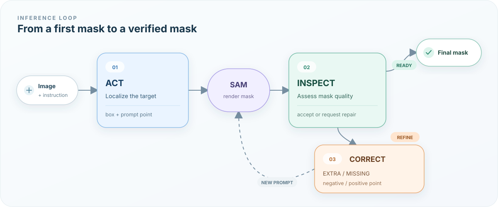
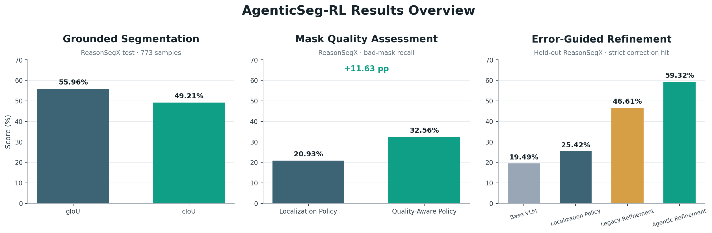
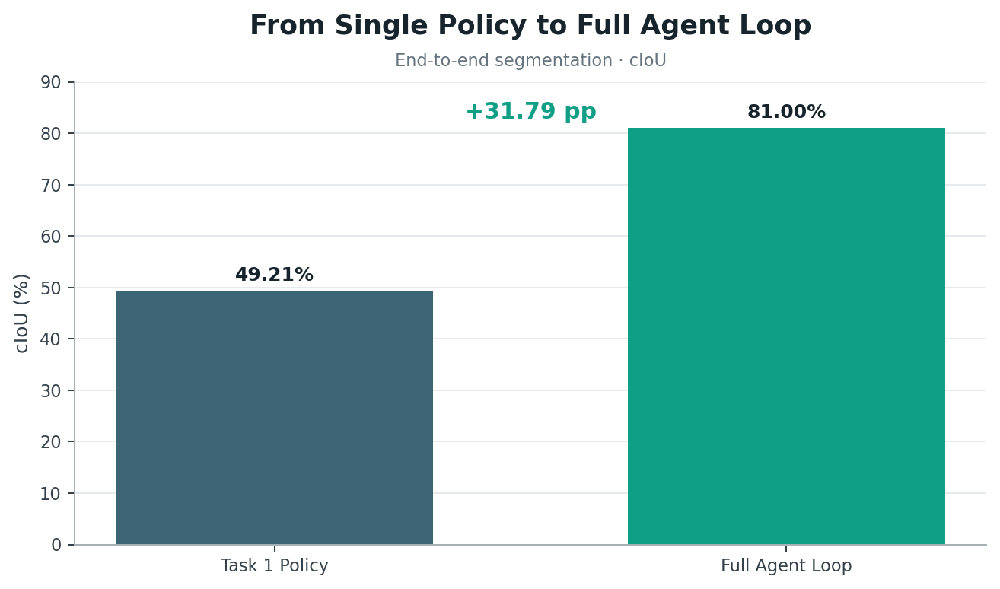
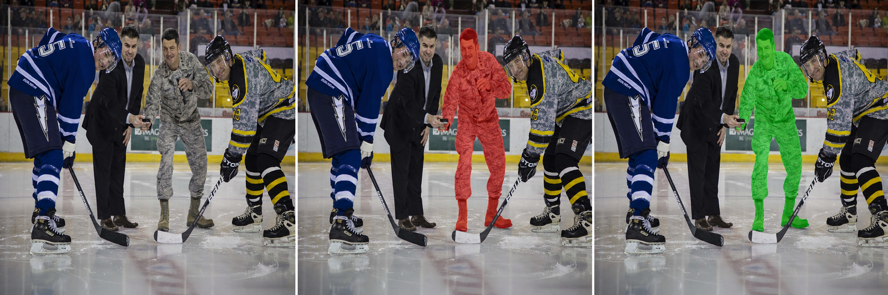
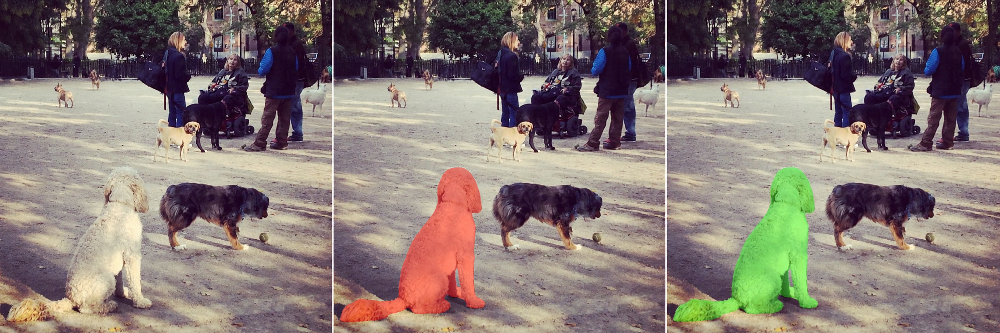
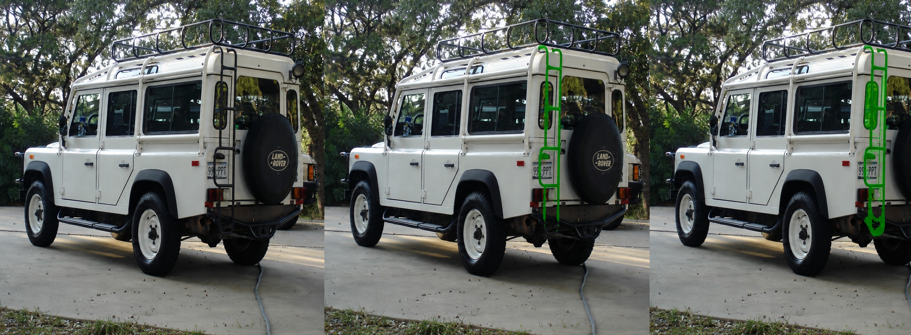
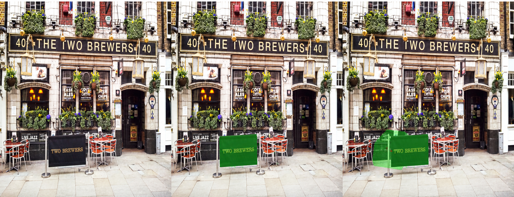
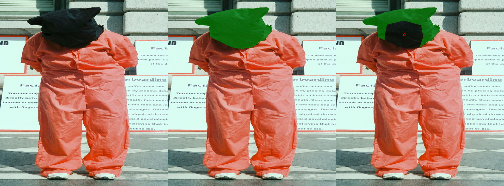
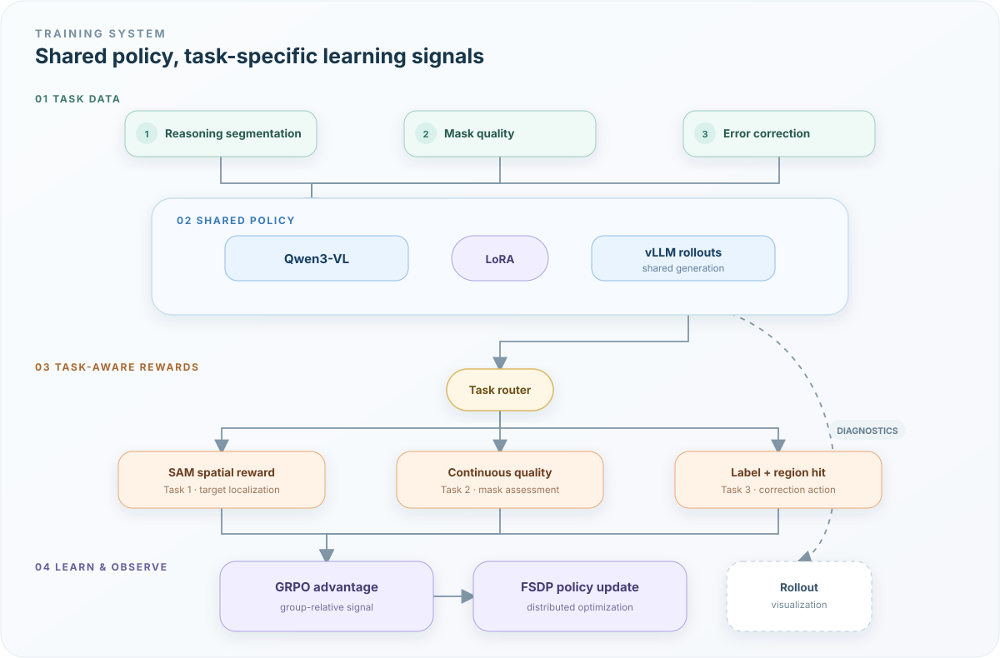

<div align="center">

# AgenticSeg-RL

### Use SAM Like a Human Annotator: Act. Inspect. Correct.

**Teaching vision-language models to inspect and repair their own segmentation masks**

[](https://www.python.org/)
[](https://pytorch.org/)
[](https://github.com/volcengine/verl)
[](LICENSE)

**AgenticSeg-RL is a modular reinforcement learning system for reasoning-driven image segmentation.**
It trains three specialized capabilities - target localization, mask inspection, and error-guided correction - and orchestrates them through an inference-time Agent Loop. The VLM understands instructions, inspects masks, and produces spatial actions; SAM executes those actions as segmentation masks.

</div>

---

## Overview

Segmentation failures in complex scenes are rarely all-or-nothing. A model may find the right object but miss part of it, include a neighboring instance, or produce a plausible mask with a critical local defect. One-shot reasoning segmentation has no explicit mechanism to inspect the current mask and act on the error it finds.

AgenticSeg-RL turns segmentation into an **Act-Inspect-Correct** process:

<p align="center">
  
</p>

Each capability is trained with dedicated data and reward signals, then assigned a clear role in the loop:

| Stage | Capability | Model output | Role in the loop |
|---|---|---|---|
| **Act** | Grounded Segmentation | Target box, prompt point, and mask | Ground language reasoning in an image region |
| **Inspect** | Mask Quality Assessment | Continuous quality score and accept/refine decision | Decide whether the current mask is ready |
| **Correct** | Error-Guided Refinement | EXTRA/MISSING label and correction point | Convert a mask defect into an executable spatial action |

## Highlights

- **Closed-loop reasoning segmentation:** jointly models localization, inspection, and correction instead of treating segmentation as a single prediction.
- **Modular GRPO capability training:** optimizes three specialized policies through shared distributed infrastructure and task-specific rewards.
- **Controllable correction synthesis:** creates EXTRA and MISSING errors by adding false-positive regions or deleting true-mask regions.
- **Spatial correction rewards:** jointly optimize structured output, error diagnosis, and the geometry of the predicted correction point.
- **Rollout visualization:** renders samples, candidate answers, reward components, and hit regions during training with local and W&B logging.
- **End-to-end engineering stack:** includes dataset construction, Hugging Face conversion, distributed training, multi-GPU evaluation, case analysis, and statistical reporting.

## Results

The three independently trained capabilities are evaluated both in isolation and as a complete Agent Loop:

| Capability | Evaluation | Primary metric | Result |
|---|---|---|---:|
| **Full Agent Loop** | End-to-end dynamic orchestration | cIoU | **81.00%** |
| Grounded Segmentation | ReasonSegX test, 773 samples | gIoU / cIoU | **55.96% / 49.21%** |
| Mask Quality Assessment | ReasonSegX, 237 samples | Bad-mask Recall | **32.56%** |
| Error-Guided Refinement | Held-out ReasonSegX, 118 samples | Strict Correction Hit | **59.32%** |

<p align="center">
  
</p>

### Full Agent Loop

The full system does not ask one monolithic model to solve all three tasks in a single response. It invokes specialized policies according to the current segmentation state:

1. **Act:** Grounded Segmentation produces the initial mask from the image and language instruction.
2. **Inspect:** Mask Quality Assessment accepts the mask or requests another correction round.
3. **Correct:** Error-Guided Refinement predicts EXTRA or MISSING and places a correction point.
4. **Re-Act:** SAM receives the point as a new positive or negative prompt.
5. Inspect-Correct-Re-Act repeats until the quality gate accepts the mask or the loop reaches its budget.

This orchestration reaches **81.00% end-to-end cIoU**. Compared with the single-pass Task 1 Policy at 49.21% cIoU, dynamic inspection and correction deliver an absolute gain of **31.79 percentage points**.

<p align="center">
  
</p>

### Grounded Segmentation

On the 773-sample ReasonSegX test set, the localization policy achieves **55.96% gIoU** and **49.21% cIoU**, demonstrating its ability to map compositional and relational language to spatial prompts and SAM masks.

### Mask Quality Assessment

The Inspect policy identifies candidate masks that should enter another correction round. Quality-aware training raises bad-mask recall from **20.93%** with the Localization Policy to **32.56%**, an improvement of **11.63 percentage points**. The stratified paired bootstrap interval is **[+2.33, +20.93]**.

### Error-Guided Refinement

The primary metric, **Strict Correction Hit**, requires both of the following:

1. the correct EXTRA or MISSING diagnosis;
2. a correction point inside the actual error region.

| Model | Error-type Accuracy | Error-region Localization | Strict Correction Hit |
|---|---:|---:|---:|
| Base VLM (Qwen3-VL-8B) | 47.46% | 50.00% | 19.49% |
| Localization Policy | 48.31% | 50.00% | 25.42% |
| Legacy Refinement | 74.58% | 66.95% | 46.61% |
| **Agentic Refinement** | **74.58%** | **67.80%** | **59.32%** |

- Agentic Refinement improves strict correction hit by **39.83 points** over the Base VLM, reaching **3.04x** the base success rate.
- It gains **33.90 points** over the Localization Policy, showing that finding an object and diagnosing its mask defect are distinct capabilities.
- The redesigned refinement reward adds **12.71 points** over Legacy Refinement, with a paired bootstrap interval of **[+3.39, +22.03]**.

Model selection and reporting use a fixed split. Across real-model comparisons, the evaluation covers **13,272 model responses**. Primary results use **single rollout** and do not select answers using ground truth.

## Qualitative Results

### Task 1 - Grounded Segmentation

The Act policy resolves attributes, relations, and exclusion conditions before producing spatial prompts for SAM. Red denotes the ground-truth mask and green denotes the model prediction.

> **Prompt:** Identify the person on the ice who is not a player but is holding a microphone.

<table width="100%">
  <tr><td colspan="3" align="center"></td></tr>
  <tr><td width="33.33%" align="center"><sub><b>Original Image</b></sub></td><td width="33.34%" align="center"><sub><b>Ground Truth Mask</b></sub></td><td width="33.33%" align="center"><sub><b>Model Prediction</b></sub></td></tr>
</table>

**Result:** the policy combines three constraints - on the ice, not a player, and holding a microphone - to localize the correct person at **99.48% IoU**.

> **Prompt:** Find the dog whose posture is different from the others.

<table width="100%">
  <tr><td colspan="3" align="center"></td></tr>
  <tr><td width="33.33%" align="center"><sub><b>Original Image</b></sub></td><td width="33.34%" align="center"><sub><b>Ground Truth Mask</b></sub></td><td width="33.33%" align="center"><sub><b>Model Prediction</b></sub></td></tr>
</table>

**Result:** the policy compares multiple dogs and selects the only sitting instance, producing a mask at **99.52% IoU**.

### Task 2 - Mask Quality Assessment

The Inspect policy receives the original image, target description, and candidate mask. The examples pair a high-quality mask that should be accepted with an incomplete mask that should be refined.

> **Prompt:** Starting from the bottom die and adding up the visible pips as you move upward, locate the die that is added when the total first exceeds 20. If two faces are visible, add both numbers.

<table width="100%">
  <tr><td colspan="3" align="center"></td></tr>
  <tr><td width="34.60%" align="center"><sub><b>Original Image</b></sub></td><td width="34.41%" align="center"><sub><b>Ground Truth Mask</b></sub></td><td width="30.99%" align="center"><sub><b>Candidate Mask</b></sub></td></tr>
</table>

**Inspect action: `ACCEPT`.** The candidate completely covers the target die at **99.40% IoU**, so the loop avoids an unnecessary correction round.

> **Prompt:** What kind of object can I use to climb onto the car roof in order to load items onto the roof rack?

<table width="100%">
  <tr><td colspan="3" align="center"></td></tr>
  <tr><td width="35.62%" align="center"><sub><b>Original Image</b></sub></td><td width="35.67%" align="center"><sub><b>Ground Truth Mask</b></sub></td><td width="28.71%" align="center"><sub><b>Candidate Mask</b></sub></td></tr>
</table>

**Inspect action: `REFINE`.** The candidate misses the lower half of the ladder and contains local noise. At **52.25% IoU**, it is routed to the Correct stage.

### Task 3 - Error-Guided Refinement

The Correct policy turns a mask defect into a SAM-compatible action. `EXTRA` produces a negative point inside an unwanted region; `MISSING` produces a positive point inside a missing region. The red circle in the third panel marks the predicted correction point.

> **Prompt:** Locate the object that displays the venue's name in text and functions as a physical barrier separating the sidewalk from the outdoor seating.

<table width="100%">
  <tr><td colspan="3" align="center"></td></tr>
  <tr><td width="33.33%" align="center"><sub><b>Original Image</b></sub></td><td width="33.34%" align="center"><sub><b>Ground Truth Mask</b></sub></td><td width="33.33%" align="center"><sub><b>Corrupted Mask<br/>+ Correction Point</b></sub></td></tr>
</table>

**Correction: `EXTRA` + negative point.** The candidate spills onto the neighboring barrier. The policy places its point inside the extra region so SAM can remove it.

> **Prompt:** In this performance protesting torture, identify the item worn to denounce the control of detainees through sensory and psychological means.

<table width="100%">
  <tr><td colspan="3" align="center"></td></tr>
  <tr><td width="33.33%" align="center"><sub><b>Original Image</b></sub></td><td width="33.34%" align="center"><sub><b>Ground Truth Mask</b></sub></td><td width="33.33%" align="center"><sub><b>Corrupted Mask<br/>+ Correction Point</b></sub></td></tr>
</table>

**Correction: `MISSING` + positive point.** The candidate omits the center of the hood. The policy places its point inside the missing region so SAM can recover it.

## System Architecture

<p align="center">
  
</p>

### Task-Aware Reward Routing

`verl/agentic/router.py` identifies each task from its ground-truth structure:

- samples containing `bbox_2d` use the Task 1 localization reward;
- samples containing `label` use the Task 2 quality reward;
- samples containing `point_label` use the Task 3 correction reward.

The tasks share rollout generation, advantage estimation, and policy updates while keeping their reward logic independent and testable.

### Continuous Mask-Quality Reward

Task 2 predicts a structured `quality_score`. Its reward combines format validity with continuous quality error:

```text
R_task2 = R_format + 5 * (1 - |quality_target - quality_score|)^2
```

Unlike a binary label alone, the continuous score represents intermediate states such as "nearly usable, but still worth refining" and supports configurable decision thresholds.

### Geometric Error-Region Reward

Task 3 decomposes correction into semantic diagnosis and spatial localization:

- `point_label` selects EXTRA or MISSING;
- `point_2d` targets the region that should be removed or recovered;
- points inside the changed-region polygon receive the full spatial reward;
- outside points receive distance-decayed reward based on the polygon boundary;
- incorrect labels gate the spatial reward, requiring diagnosis and localization to agree.

This objective supplies denser supervision than classification accuracy alone and directly matches Strict Correction Hit at evaluation time.

## Data Construction

### Task 2 - Mask Quality Assessment

The Task 2 builder reads images, target descriptions, ground-truth masks, and candidate masks; computes effective IoU and boundary-aware quality; and renders candidate-mask overlays for visual inspection.

```bash
python tools/datasets/build_task2_mask_understanding_dataset.py \
  --dataset-path data/base_segmentation_train \
  --split train \
  --output-dir data/agenticrl/task2_mask_understanding/base_dataset
```

### Task 3 - Error-Guided Refinement

The Task 3 builder applies controlled perturbations to ground-truth masks:

- **False Positive / EXTRA:** add a region near the target boundary;
- **False Negative / MISSING:** delete a local region from the true target.

Generation records the changed polygon, region center, area, and correction label for geometric rewards and visualization.

```bash
python tools/datasets/build_task3_self_correction_dataset.py \
  --dataset-path data/base_segmentation_train \
  --split train \
  --output-dir data/agenticrl/task3_self_correction/base_dataset \
  --addition-mode boundary \
  --seed 42
```

Convert generated assets into Hugging Face datasets:

```bash
python tools/datasets/build_hf_dataset_from_agentic_assets.py --help
```

## Quick Start

### 1. Install

```bash
conda create -n agenticseg python=3.12 -y
conda activate agenticseg
pip install -r requirements_qwen3.txt
pip install -e .
```

AgenticSeg-RL targets Linux systems with NVIDIA GPUs and supports Qwen2.5-VL and Qwen3-VL. Place datasets, reasoning-model weights, and SAM checkpoints according to:

- [`data/README.md`](data/README.md)
- [`pretrained_models/README.md`](pretrained_models/README.md)
- [`sam2/checkpoints/README.md`](sam2/checkpoints/README.md)

### 2. Prepare Models and Data

```text
pretrained_models/
|-- Qwen3-VL-8B-Instruct/
`-- reasoning-model/

data/
|-- base_segmentation_train/
|-- ReasonSegX_val/
`-- hf_agentic/
    `-- base_dataset/
        |-- task2/
        `-- task3/
```

### 3. Train the Three Capabilities

The main launch configuration uses Qwen3-VL-8B, LoRA, and GRPO:

```bash
bash scripts/train/8b_stage1_mixed_3tasks.sh
```

Continue correction training from a localization adapter:

```bash
CKPT_PATH=checkpoints/stage1/actor/lora_adapter \
  bash scripts/train/8b_stage1_1to3tasks.sh
```

Training configuration exposes rollout count, tensor parallelism, memory utilization, LoRA rank, learning rate, and checkpoint frequency.

### 4. Multi-GPU Evaluation

```bash
BASE_MODEL_PATH=pretrained_models/Qwen3-VL-8B-Instruct \
REASONING_MODEL_PATH=pretrained_models/reasoning-model \
TEST_DATA_PATH=data/ReasonSegX_val \
  bash scripts/evaluate/reasonseg_8b_task3.sh
```

The evaluation pipeline partitions data across GPUs, parses structured outputs, generates masks with SAM, computes IoU, ranks failure cases, and saves visualizations.

### 5. Analyze Rollouts

```bash
python tools/rollout_analysis/analyze_task3_rollout_log.py \
  --input-log outputs/train.log \
  --output-root outputs/analysis
```

The analyzer produces rollout-level CSV files, sample statistics, training curves, sampling-budget analysis, and visual reports.

## Reinforcement Learning Stack

AgenticSeg-RL uses GRPO to estimate group-relative advantages across multiple rollouts for the same prompt.

| Component | Role |
|---|---|
| **Qwen3-VL** | Vision-language reasoning and structured action generation |
| **LoRA** | Parameter-efficient policy updates |
| **vLLM** | Multi-candidate rollout generation |
| **Ray** | Training-process orchestration |
| **FSDP** | Multi-GPU parameter sharding and updates |
| **SAM / SAM2** | Convert spatial prompts into candidate masks |
| **W&B + local renderer** | Reward decomposition, sample tracking, and visual diagnostics |

```text
Prompt + Image
    -> Group Rollouts
    -> Structured Response Parsing
    -> Task-Aware Reward Routing
    -> Reward Component Decomposition
    -> Group-Relative Advantage
    -> LoRA Policy Update
```

## Engineering

### Rollout Visualization

`verl/agentic/rollout_viz.py` renders original images, candidate masks, predicted points, error labels, and reward components during training. Visualizations can be stored locally or synchronized to W&B without changing the reward path.

### Structured Action Protocol

The model uses a unified `<think>...</think><answer>...</answer>` protocol and returns JSON inside `<answer>`. Task layers validate formatting, normalize coordinates, parse labels, and handle malformed responses so training rewards and deployment actions share the same contract.

### Sample-Level Diagnostics

Evaluation tools preserve model responses, sampled candidates, mask areas, boundary relations, and error-region hits alongside aggregate IoU. Reports can isolate label errors, point displacement, small-target failures, multi-object omissions, and sampling instability.

## Tests

Run lightweight unit tests:

```bash
pytest -q tests
```

Run Agentic task integration tests in the full training environment:

```bash
pytest -q verl/agentic/test_integration.py verl/agentic/test_rollout_viz.py
```

Run static and formatting checks:

```bash
make quality
```

## Repository Layout

```text
AgenticSeg-RL/
|-- assets/                     # Result figures and qualitative examples
|-- configs/                    # GRPO, model, and distributed training config
|-- data/                       # Local datasets and generated assets
|-- pretrained_models/          # Vision-language and reasoning-model weights
|-- checkpoints/                # LoRA and training checkpoints
|-- scripts/
|   |-- train/                  # Single-task, mixed-task, and staged training
|   |-- evaluate/               # Multi-GPU ReasonSeg / ReasonSegX evaluation
|   `-- inference/              # Multi-object inference
|-- tools/
|   |-- datasets/               # Task 2/3 data construction and conversion
|   |-- data_analysis/          # Statistics, sampling, and visualization
|   |-- evaluation/             # IoU, case analysis, and evaluation pipeline
|   |-- rollout_analysis/       # Rollout aggregation and reporting
|   `-- benchmark_preparation/  # Benchmark conversion tools
|-- tests/                      # Lightweight unit tests
|-- verl/agentic/               # Reward routing, Task 2/3 rewards, rollout views
|-- Dockerfile
|-- Makefile
`-- pyproject.toml
```

## Technology

`PyTorch` | `Transformers` | `Qwen3-VL` | `GRPO` | `vLLM` | `Ray` | `FSDP` | `LoRA` | `SAM/SAM2` | `OpenCV` | `Hugging Face Datasets` | `Weights & Biases`

## License

This project is released under the [Apache License 2.0](LICENSE). Third-party components and their license information are listed in [THIRD_PARTY.md](THIRD_PARTY.md).
